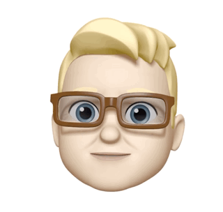
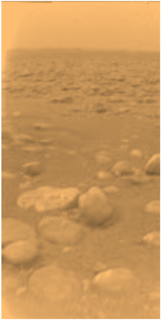

# Hi there, I'm Andy 👋

### I'm an iOS Developer based in Munich, Germany 🇩🇪, and originally from the UK 🇬🇧 

- 🌱 I’m currently a freelance senior iOS developer (remote or munich based)
- 🍕 I'm a co-organiser of the [Munich iOS Developers Meetup group](https://www.meetup.com/The-Munich-iOS-Developers-Meetup)
- ⛰  I enjoy creating mountain videography for [my channel](https://www.youtube.com/channel/UCmt50IAPXu00bLEjJM8AX9w) 
- 🎸 I'm an active musician in [Heavy Rotators](https://soundcloud.com/heavyrotators) 
- 📫 How to reach me: [linkedin](https://www.linkedin.com/in/andy-bell-ios) 
- ⚡ Fun fact: Here is a picture of the surface of Titan taken by the Cassini/Huygens probe. Titan was about 1.2 Billion kilmoeters from Earth when this picture was taken! 😵🪐 

